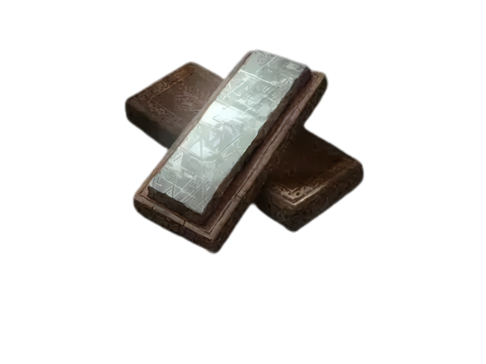

<p align="center">
  
</p>

<h1 align="center">Smithbox for Linux</h1>

<p align="center">
  A Linux-only build of <a href="https://github.com/vawser/Smithbox">Smithbox</a>, a modding tool for<br>
  Elden Ring, Dark Souls III, Armored Core VI, Nightreign and other FromSoftware games.
</p>

<p align="center">
  <a href="https://github.com/SrDeTs/Smithbox-For-Linux/releases"><b>⬇ Download</b></a>
  &nbsp;&bull;&nbsp;
  <a href="#building-from-source"><b>🔨 Build</b></a>
  &nbsp;&bull;&nbsp;
  <a href="#platform-notes"><b>📋 Platform Notes</b></a>
  &nbsp;&bull;&nbsp;
  <a href="https://github.com/vawser/Smithbox"><b> upstream Project</b></a>
</p>

---

All Windows- and macOS-specific code paths, native binaries and build configurations have been removed. Only **Linux (`linux-x64`)** is supported.

## Supported Games

| Game | Project Type | Oodle Library |
|------|-------------|---------------|
| Elden Ring | `ER` | `liboo2corelinux64.so.9` |
| Dark Souls III | `DS3` | `liboo2corelinux64.so.6` |
| Armored Core VI | `AC6` | `liboo2corelinux64.so.8` |
| Nightreign | `NR` | `liboo2corelinux64.so.9` |
| Sekiro | `SDT` | `liboo2corelinux64.so.6` |
| Dark Souls II / SOTFS | `DS2` / `DS2S` | — |
| Dark Souls / PTDE / Remastered | `DS1` / `DS1R` | — |
| Bloodborne | `BB` | `liboo2corelinux64.so.6` |
| Demon's Souls | `DES` | — |

## Requirements

- **.NET 10 SDK** — `dotnet --version` should print `10.x`
- **Vulkan-capable GPU + drivers** (an OpenGL fallback is also available)
- **SDL2 runtime** (usually pre-installed on most distros)
- For packaging: `dpkg-deb`, `rpmbuild`, `makepkg`, and/or `appimagetool`
  depending on which package formats you want to build.

## Building from source

```bash
# restore + build the full solution (default = Release-linux)
make build

# or a debug build
make build-debug

# publish a self-contained app to ./linux-x64
make publish

# run directly from source
make run
```

Then launch the published app:

```bash
cd linux-x64
./smithbox
```

> **Tip:** The published `linux-x64/` directory is fully self-contained — it bundles the .NET runtime, all native `.so` libraries (cimgui, SDL2, Vulkan, etc.), and assets. No additional installs needed on the target machine.

## Oodle Textures (DS3 / ER / AC6 / NR / SDT / BB)

Some games use Oodle-compressed textures. The approach differs by Oodle version:

### Oodle 2.9 (Nightreign)

`liboo2corelinux64.so.9` is already bundled in the build output — no manual copy needed.

### Oodle 2.8 (Armored Core VI)

Copy `liboo2corelinux64.so.8` from your Armored Core VI game install into the `linux-x64/` directory.

### Oodle 2.6 (DS3 / ER / SDT / BB) — linoodle

Linux `.so` files for Oodle 2.6 are **not publicly available**. The solution is [linoodle](https://github.com/McSimp/linoodle) — a native Linux PE loader that wraps the Windows `oo2core_6_win64.dll`.

**Setup:**

1. Build linoodle (see below)
2. Copy the built `liboo2corelinux64.so.6` into `linux-x64/`
3. Copy `oo2core_6_win64.dll` from your game install into `linux-x64/`
4. Both files must be side-by-side next to the `smithbox` binary

**Building linoodle:**

```bash
git clone https://github.com/McSimp/linoodle.git /tmp/linoodle-src
cd /tmp/linoodle-src
git submodule update --init --recursive

# Apply Smithbox modifications (see LINOODLE_CHANGES.md in repo root)

mkdir build && cd build
cmake .. -DCMAKE_BUILD_TYPE=Release \
  -DCMAKE_C_COMPILER=/usr/bin/gcc-15 \
  -DCMAKE_CXX_COMPILER=/usr/bin/g++-15
make -j$(nproc)
```

Then copy the wrapper:

```bash
cp liblinoodle.so /path/to/smithbox-linux/liboo2corelinux64.so.6
```

> **Note:** linoodle loads the Windows `oo2core_6_win64.dll` directly via mmap — no Wine dependency.

## Packaging

Smithbox for Linux can be packaged into multiple formats:

```bash
make package          # build deb + rpm + pacman + AppImage + Flatpak
make package-deb      # only the .deb
make package-rpm      # only the .rpm
make package-pacman   # only the pacman (Arch) package
make package-appimage # only the AppImage
make package-flatpak  # only the Flatpak

make release          # gather all artifacts + portable tarball + sha256sums
```

Artifacts land under `artifacts/package/<format>/`. The release bundle is assembled in `artifacts/package/release/smithbox-<version>/`.

### Package contents

Each package installs:
- **Binary:** `/opt/smithbox/` (self-contained app)
- **Symlink:** `/usr/local/bin/smithbox`
- **Desktop entry:** `/usr/share/applications/smithbox.desktop`
- **Icon:** `/usr/share/icons/hicolor/256x256/apps/smithbox.png`

## Running the unit tests

```bash
make test
```

## Platform Notes

### What works on Linux

- ✅ All editors (Param, Map, Model, Texture, Material, Gparam, Text, File Browser)
- ✅ Param Editor save/load (all games)
- ✅ Soapstone gRPC server (interop with DSMapStudio)
- ✅ Vulkan and OpenGL rendering backends
- ✅ Native file dialogs (via NativeFileDialogSharp)
- ✅ Steam game auto-detection (Linux paths)

### What's disabled on Linux (Win32-only)

- ❌ **Live param reload / ItemGib** — injects param changes into a running game process via `kernel32.dll` P/Invoke (Win32 process injection). This is fundamentally a Windows feature and is compiled out on Linux. All other param editor functionality (editing, saving, exporting) works normally.
- ❌ **NavGen navmesh builder** — depends on `NavGen.dll`, a native C++ library built with MSVC. The source remains for future cross-platform compilation.

### Optional: Tracy Profiler

The Tracy profiler integration is optional and disabled by default. To enable it:

1. Build `libTracyClient.so` from [Tracy](https://github.com/wolfpld/tracy):
   ```bash
   git clone https://github.com/wolfpld/tracy
   cd tracy
   cmake -S . -B build -DBUILD_SHARED_LIBS=ON -DTRACY_FIBERS=ON -DTRACY_MANUAL_LIFETIME=ON -DTRACY_DELAYED_INIT=ON
   cmake --build build --config Release --target TracyClient
   ```
2. Copy the resulting `libTracyClient.so` next to `smithbox`
3. Run with `SMITHBOX_PROFILER=1`

## Troubleshooting

### App won't start
- Ensure you have Vulkan drivers installed: `vulkaninfo | head`
- Try the OpenGL fallback: set `System_RenderingBackend` to `OpenGL` in the config
- Check the crash log in `Crash Logs/` next to the executable

### Params don't save
- Make sure you have a **mod project path** set (not editing the game directory directly)
- Check the in-app log for error messages
- Ensure the project directory is writable

### Textures show as missing/corrupted
- Copy the correct `liboo2corelinux64.so.*` for your game into the `linux-x64/` directory
- For Oodle 2.6 (DS3/ER/SDT/BB), build linoodle and copy `oo2core_6_win64.dll` from your game install

## Issues

For any issues or errors, please report to:
- **This fork:** [github.com/SrDeTs/Smithbox-For-Linux/issues](https://github.com/SrDeTs/Smithbox-For-Linux/issues)
- **upstream Smithbox:** [github.com/vawser/Smithbox](https://github.com/vawser/Smithbox?tab=contributing-ov-file)

## Credits (Smithbox)
* Vawser
* ivi
* nex3
* gixxpunk
* Strackeror
* FireWolf700
* GoogleBen
* LordExelot
* Pear0533
* Metito
* WarpZehpyr
* twistedgwazi
* FeeeeK
* colaaaaaa123
* alson041
* gracenotes

## Credits (DSMapStudio)
* Katalash
* philiquaz
* george
* thefifthmatt
* TKGP
* Nordgaren
* [Pav](https://github.com/JohrnaJohrna)
* [Meowmaritus](https://github.com/meowmaritus)
* [PredatorCZ](https://github.com/PredatorCZ)
* [Horkrux](https://github.com/horkrux)
* Shadowth117

---

<p align="center">
  <sub>Linux build maintained by <a href="https://github.com/SrDeTs">SrDeTs</a></sub><br>
  <sub>upstream by <a href="https://github.com/vawser">Vawser</a> and contributors</sub>
</p>
